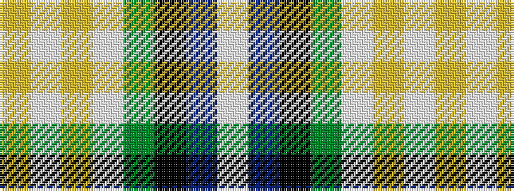

WBKGWYWY

It is a 8 stripe tartan.

<figure class="pat-woven">

<figcaption>idealised sample</figcaption>
</figure>

## Colour Sequence



## Tartans with this colour sequence

| Tartans |
|---------------|
| [MacLaren](/setts/s8/w16db4k12g4w6lo4w11ly7~x2/)|
||
| [MacLaren Dress (Dance)](/setts/s8/w16db4k12dg4w6lo4w11ly7~x2/)|
||
