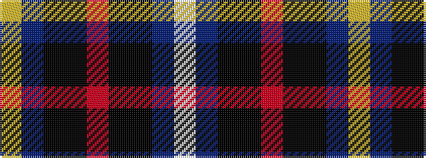

WBKKRKKBY

It is a 9 stripe tartan.

<figure class="pat-woven">

<figcaption>idealised sample</figcaption>
</figure>

## Colour Sequence



## Tartans with this colour sequence

| Tartans |
|---------------|
| [Highland Titles](/variants/s9/ly6b15k20ki25o40ki25k20b15w4/)|
||
