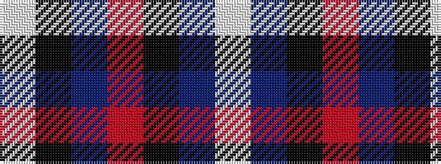

WBKRBKW

It is a 7 stripe tartan.

<figure class="pat-woven">

<figcaption>idealised sample</figcaption>
</figure>

## Colour Sequence



## Tartans with this colour sequence

| Tartans |
|---------------|
| [Phantom (Corporate)](/variants/s7/w3dr10k38o11dr6k2w3~x2/)|
||
