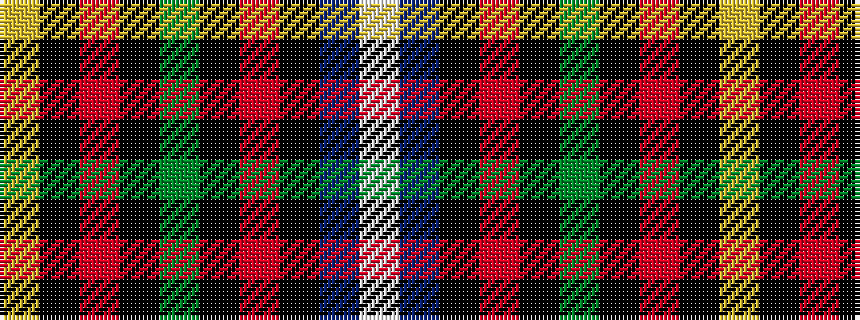

WBKRKGKRKY

It is a 10 stripe tartan.

<figure class="pat-woven">

<figcaption>idealised sample</figcaption>
</figure>

## Colour Sequence



## Tartans with this colour sequence

| Tartans |
|---------------|
| [Tantallon](/variants/s10/w3db21k2r7k2g10k2r7k21ly3~x2/)|
||
| [Tantallon #2](/variants/s10/w3db22k2r7k2dg10k2r7k22ly3~x2/)|
||
