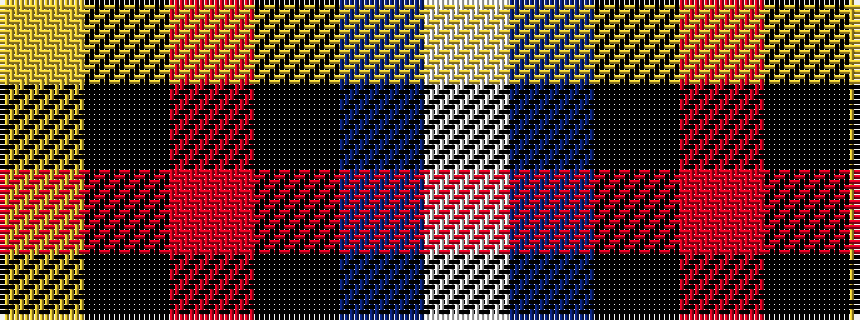

WBKRKY

It is a 6 stripe tartan.

<figure class="pat-woven">

<figcaption>idealised sample</figcaption>
</figure>

## Colour Sequence



## Tartans with this colour sequence

| Tartans |
|---------------|
| [Clunie (Name)](/setts/s6/w6db24k7o11k2ly6~x2/)|
||
| [Clunie (Personal)](/setts/s6/w12db48k13o22k3ly6/)|
||
