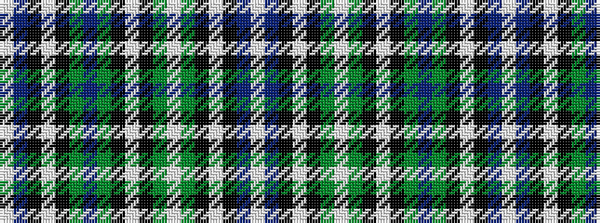

WBKWKGBGKWKGWGKWKBW

It is a 19 stripe tartan.

<figure class="pat-woven">

<figcaption>idealised sample</figcaption>
</figure>

## Colour Sequence



## Tartans with this colour sequence

| Tartans |
|---------------|
| [Caribou](/variants/s19/w1dr4k1lt3k1y4db1y4k1lt3k1g4lt1g4k1lt3k1dr4w1~x4/)|
||
