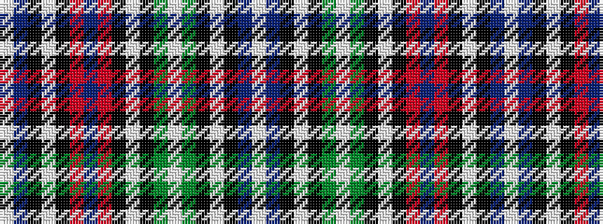

WBKWKGWGKWKRBRKWKBW

It is a 19 stripe tartan.

<figure class="pat-woven">

<figcaption>idealised sample</figcaption>
</figure>

## Colour Sequence



## Tartans with this colour sequence

| Tartans |
|---------------|
| [Caribou District Tartan Tartan Number: 2056. Earliest known date: 1982 Proposed by the Caribou Islands District Fire Hall (Ladies Auxilary). Among the suggestions for the symbolic meaning of the colours it says, "Red for our sunsets, our lobsters, and our Fire Trucks". Caribou is in Pictou County, Nova Scotia. See products available Copyright © Blair Urquhart, Comrie, 2015](/setts/s19/w1dr4k1lb3k1o4db1o4k1lb3k1g4lb1g4k1lb3k1dr4w1~x4/)|
||
