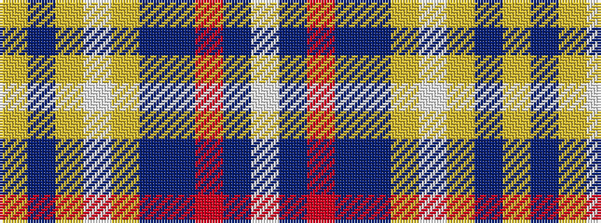

WBRBBYWYBY

It is a 10 stripe tartan.

<figure class="pat-woven">

<figcaption>idealised sample</figcaption>
</figure>

## Colour Sequence



## Tartans with this colour sequence

| Tartans |
|---------------|
| [Gray, Sir John Hamilton (Commem)](/setts/s10/w4dt6r3dt10n14lo6w18lo6n4lo2~x2/)|
||
