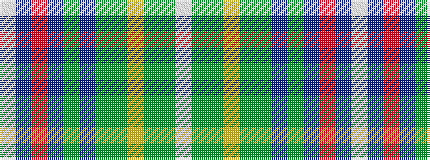

WBRBGBGGYGGW

It is a 12 stripe tartan.

<figure class="pat-woven">

<figcaption>idealised sample</figcaption>
</figure>

## Colour Sequence



## Tartans with this colour sequence

| Tartans |
|---------------|
| [St Ninian's Day](/variants/s12/w4g1gi31ly1gi4g21t4g1t36r2t9w2~x2/)|
||
| [St. Ninian (Commemorative)](/variants/s12/w4dg1g31ly1g4dg21dt4dg1dt36r2dt9w2~x2/)|
||
