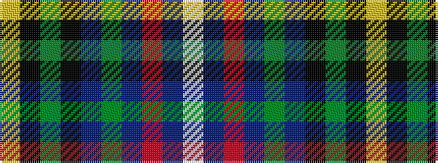

WBRBGBKGKY

It is a 10 stripe tartan.

<figure class="pat-woven">

<figcaption>idealised sample</figcaption>
</figure>

## Colour Sequence



## Tartans with this colour sequence

| Tartans |
|---------------|
| [Royal Air Force Lossiemouth](/setts/s10/ly4k7dg3k27db10g4t24r3t24lb4~x2/)|
||
