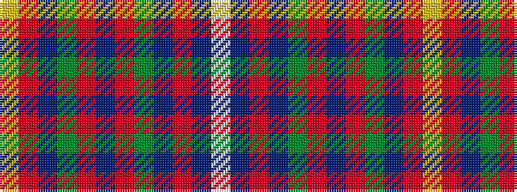

WBRBGRBRGBRY

It is a 12 stripe tartan.

<figure class="pat-woven">

<figcaption>idealised sample</figcaption>
</figure>

## Colour Sequence



## Tartans with this colour sequence

| Tartans |
|---------------|
| [Kormylo (Personal)](/setts/s12/w2db2r18db2dg20r2db40r2dg12db3r9ly2~x2/)|
||
