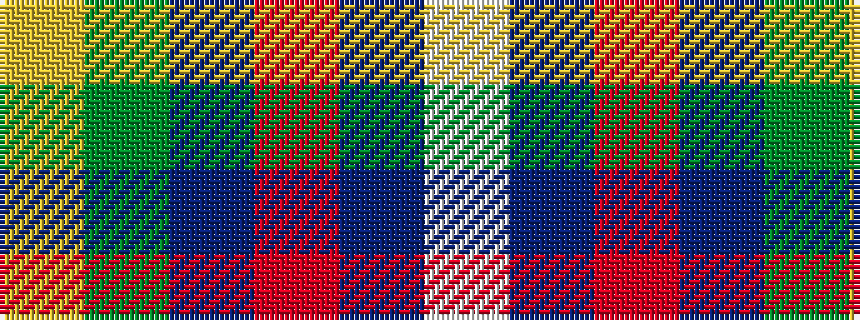

WBRBGY

It is a 6 stripe tartan.

<figure class="pat-woven">

<figcaption>idealised sample</figcaption>
</figure>

## Colour Sequence



## Tartans with this colour sequence

| Tartans |
|---------------|
| [Atlantic, Ancient](/setts/s6/w3db17o16dbi2dg17ly2~x2/)|
||
