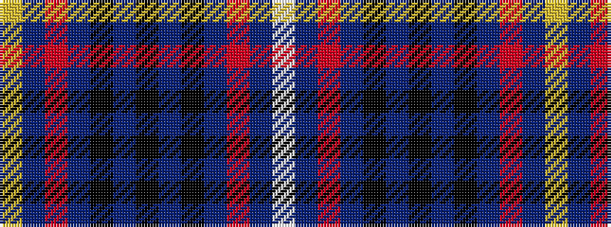

WBRBKBKBKBRBY

It is a 13 stripe tartan.

<figure class="pat-woven">

<figcaption>idealised sample</figcaption>
</figure>

## Colour Sequence



## Tartans with this colour sequence

| Tartans |
|---------------|
| [MacIver of Strome (Personal)](/variants/s13/w2db3r2db19k7db6k22db6k7db19r2db3ly2~x2/)|
||
