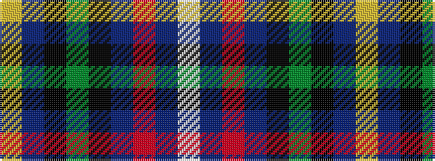

WBRBKGKBY

It is a 9 stripe tartan.

<figure class="pat-woven">

<figcaption>idealised sample</figcaption>
</figure>

## Colour Sequence



## Tartans with this colour sequence

| Tartans |
|---------------|
| [Royal Navy Submarine Service](/setts/s9/w3db3r2db14k3dg12k14db16lo2~x2/)|
||
