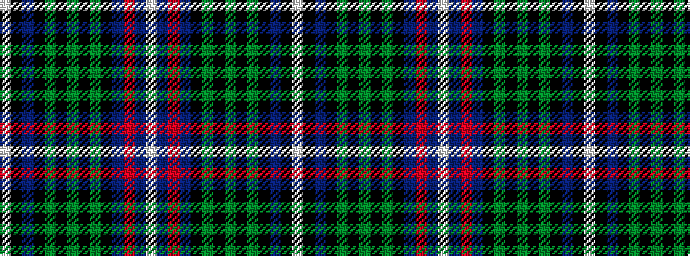

WBRBKGKGKGKBKW

It is a 14 stripe tartan.

<figure class="pat-woven">

<figcaption>idealised sample</figcaption>
</figure>

## Colour Sequence



## Tartans with this colour sequence

| Tartans |
|---------------|
| [Arndt (Personal)](/variants/s14/w5k5db25k16g18k4g5k4g18k16db25r5db5w5/)|
||
