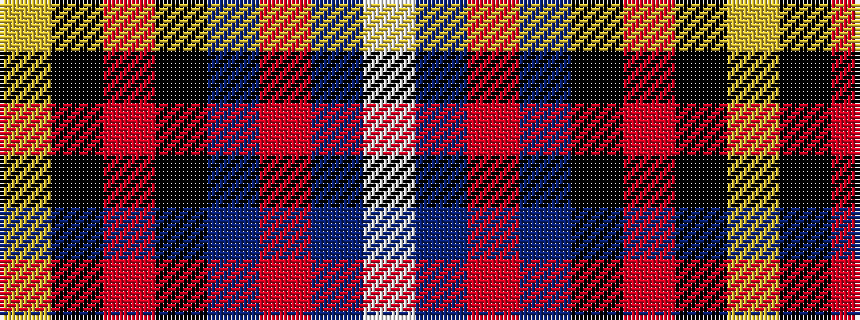

WBRBKRKY

It is a 8 stripe tartan.

<figure class="pat-woven">

<figcaption>idealised sample</figcaption>
</figure>

## Colour Sequence



## Tartans with this colour sequence

| Tartans |
|---------------|
| [Vienna Highlander (Fashion)](/variants/s8/lo3k2o15k10dt23r2dt1w2~x2/)|
||
