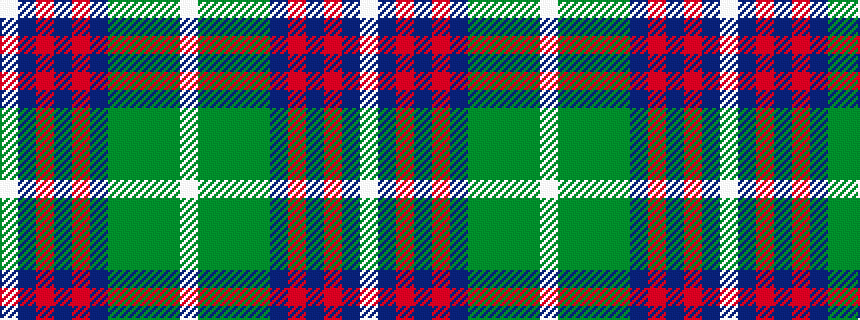

WBRBRBGGGGW

It is a 11 stripe tartan.

<figure class="pat-woven">

<figcaption>idealised sample</figcaption>
</figure>

## Colour Sequence



## Tartans with this colour sequence

| Tartans |
|---------------|
| [Wojtek Memorial Trust](/variants/s11/w3db15r6db3r3db4dg11g3dg3g28lb3~x2/)|
||
