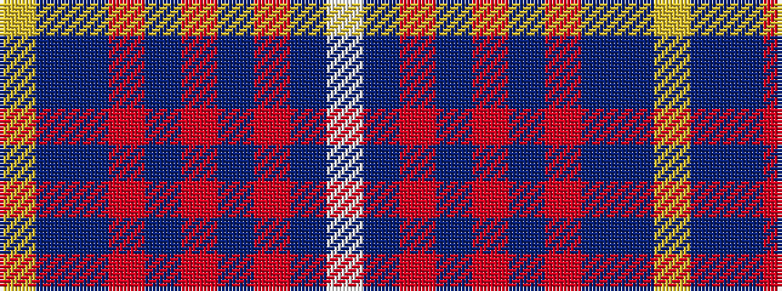

WBRBRBRBBY

It is a 10 stripe tartan.

<figure class="pat-woven">

<figcaption>idealised sample</figcaption>
</figure>

## Colour Sequence



## Tartans with this colour sequence

| Tartans |
|---------------|
| [X Marks the Scot](/setts/s10/w6db32o3db3o1db3o2dbi4db1ly2~x2/)|
||
