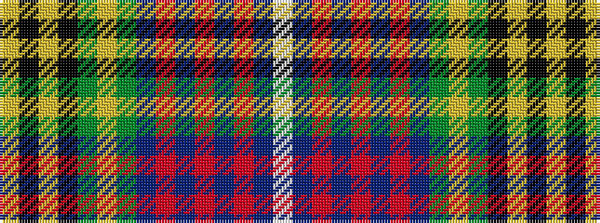

WBRBRBRBGYGKYKY

It is a 15 stripe tartan.

<figure class="pat-woven">

<figcaption>idealised sample</figcaption>
</figure>

## Colour Sequence



## Tartans with this colour sequence

| Tartans |
|---------------|
| [Linn (Personal)](/setts/s15/w3db3r1db3r1db15r1db2g15lo1g2k20lo1k2lo2~x2/)|
||
