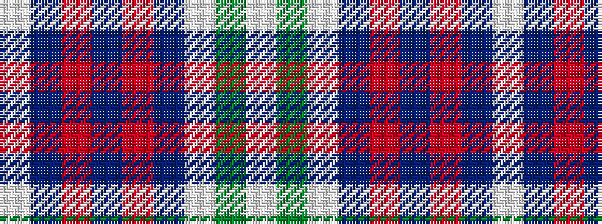

WBRBRBWGW

It is a 9 stripe tartan.

<figure class="pat-woven">

<figcaption>idealised sample</figcaption>
</figure>

## Colour Sequence



## Tartans with this colour sequence

| Tartans |
|---------------|
| [Wombles 7 (Corporate)](/variants/s9/lb3g6lb1db1r5db2o5db1lb3~x4/)|
||
