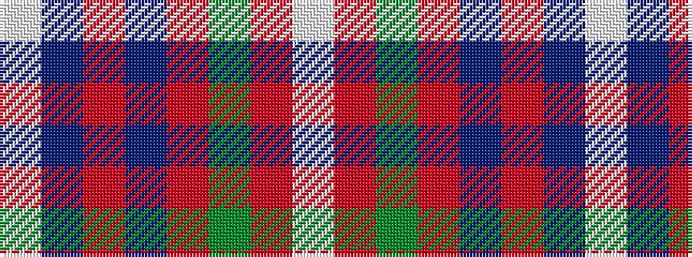

WBRBRGRW

It is a 8 stripe tartan.

<figure class="pat-woven">

<figcaption>idealised sample</figcaption>
</figure>

## Colour Sequence



## Tartans with this colour sequence

| Tartans |
|---------------|
| [Utah (US State)](/setts/s8/w2r3dg9r3db2r3db3w1~x6/)|
||
| [Utah Centennial](/setts/s8/w6r8g24r8db6r8db8w3~x2/)|
||
