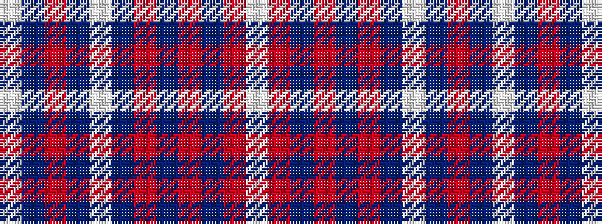

WBRBWBRBRBRW

It is a 12 stripe tartan.

<figure class="pat-woven">

<figcaption>idealised sample</figcaption>
</figure>

## Colour Sequence



## Tartans with this colour sequence

| Tartans |
|---------------|
| [Frame](/setts/s12/w4b14r1b1w1b1r1b14r14b1r1w1~x4/)|
||
| [Frame](/setts/s12/w4db14r1db1w1db1r1db14r14db1r1w1~x2/)|
||
