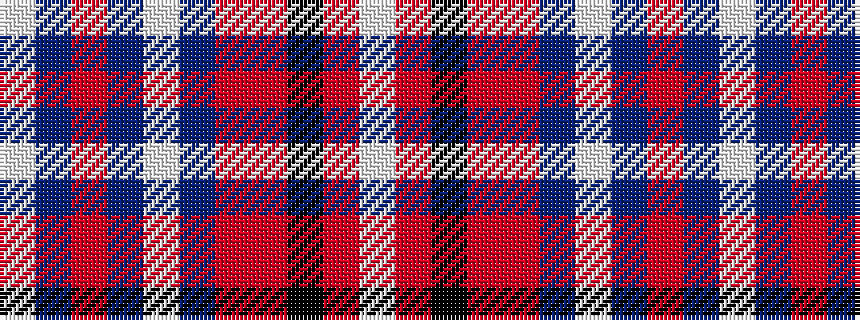

WBRBWBRRKRW

It is a 11 stripe tartan.

<figure class="pat-woven">

<figcaption>idealised sample</figcaption>
</figure>

## Colour Sequence



## Tartans with this colour sequence

| Tartans |
|---------------|
| [Glenmore Pink](/variants/s11/w60dt24oi3dt5w3dt5o16oi8k3oi6w4/)|
||
