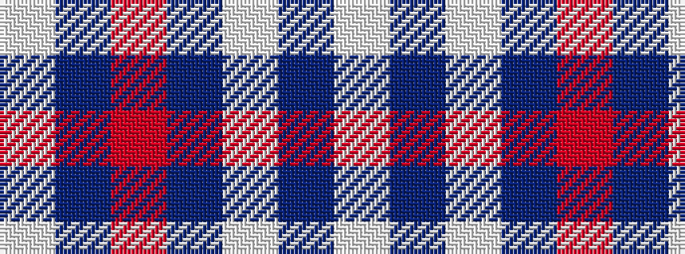

WBRBWBW

It is a 7 stripe tartan.

<figure class="pat-woven">

<figcaption>idealised sample</figcaption>
</figure>

## Colour Sequence



## Tartans with this colour sequence

| Tartans |
|---------------|
| [St Andrews Links Dress](/variants/s7/w30b4w3dp2r2dp24wi2~x2/)|
||
