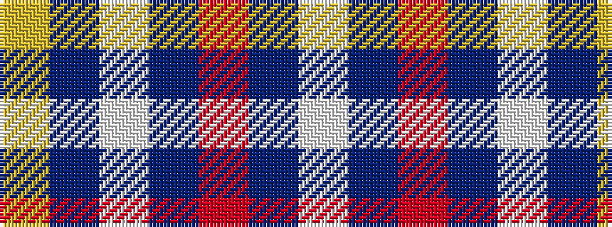

WBRBWBY

It is a 7 stripe tartan.

<figure class="pat-woven">

<figcaption>idealised sample</figcaption>
</figure>

## Colour Sequence



## Tartans with this colour sequence

| Tartans |
|---------------|
| [Fazzolettone (Fashion?)](/variants/s7/w2db3r24db15w6db3ly2~x2/)|
||
