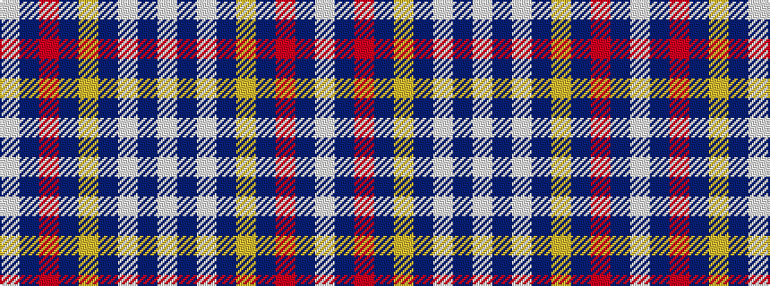

WBRBYBWBW

It is a 9 stripe tartan.

<figure class="pat-woven">

<figcaption>idealised sample</figcaption>
</figure>

## Colour Sequence



## Tartans with this colour sequence

| Tartans |
|---------------|
| [Womble](/variants/s9/w4dbi8w1db1lo6db3r6db1w4~x2/)|
||
| [Wombles 4 (Corporate)](/variants/s9/w4db8w1dbi1lo6dbi3r6dbi1w4~x4/)|
||
