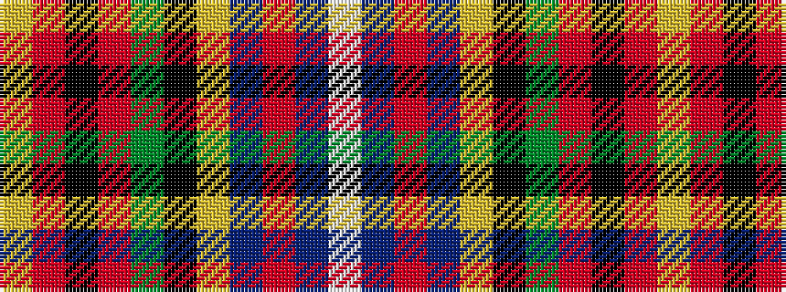

WBRBYKGRKRY

It is a 11 stripe tartan.

<figure class="pat-woven">

<figcaption>idealised sample</figcaption>
</figure>

## Colour Sequence



## Tartans with this colour sequence

| Tartans |
|---------------|
| [Crosser, Crozier](/variants/s11/w4db5r3db22ly4k3g17r7k2r7ly2~x2/)|
||
| [Crozier/Crosser](/variants/s11/w4db5r3db22ly4k3dg17r7k2r7ly2~x2/)|
||
