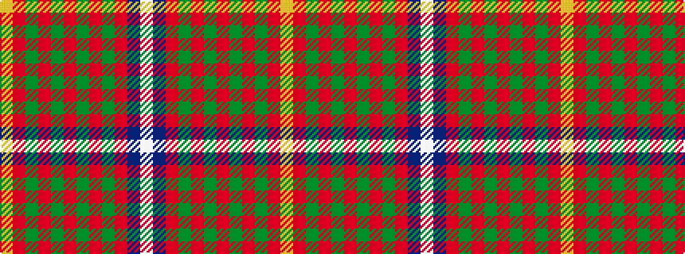

WBRGRGRGRGRY

It is a 12 stripe tartan.

<figure class="pat-woven">

<figcaption>idealised sample</figcaption>
</figure>

## Colour Sequence



## Tartans with this colour sequence

| Tartans |
|---------------|
| [Bruce County](/variants/s12/w1db1r7g2r2g6r1g6r2g2r8lo1~x4/)|
||
| [Bruce County](/variants/s12/w1db1r7g2r2g6r1g6r2g2r8ly1~x2/)|
||
