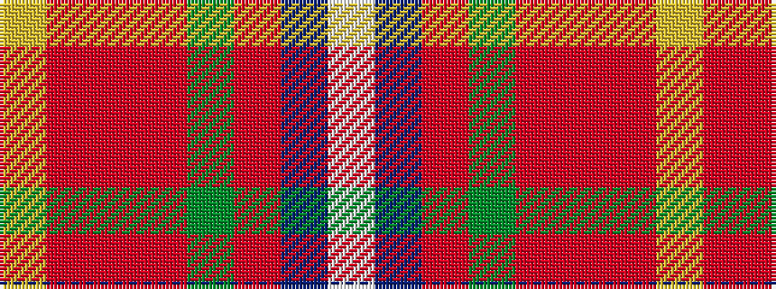

WBRGRRRY

It is a 8 stripe tartan.

<figure class="pat-woven">

<figcaption>idealised sample</figcaption>
</figure>

## Colour Sequence



## Tartans with this colour sequence

| Tartans |
|---------------|
| [Washington DC (Fashion)](/variants/s8/lo5o39r16o5g6o5b32lb5~x2/)|
||
