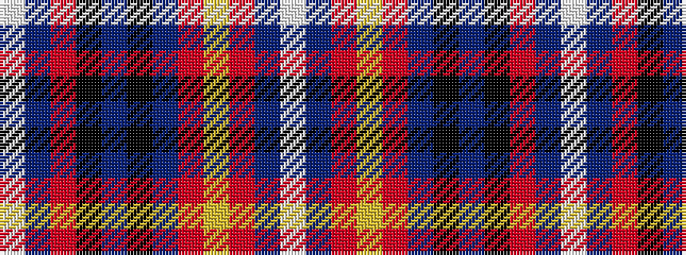

WBRKBKBRYRBW

It is a 12 stripe tartan.

<figure class="pat-woven">

<figcaption>idealised sample</figcaption>
</figure>

## Colour Sequence



## Tartans with this colour sequence

| Tartans |
|---------------|
| [Clinton Wedding](/setts/s12/w5db6r20k6n5k3db26r2ly1r2db3w3~x2/)|
||
| [Clinton Wedding (Personal)](/setts/s12/w5db6r20k6t5k3db26r2ly1r2db3w3~x2/)|
||
