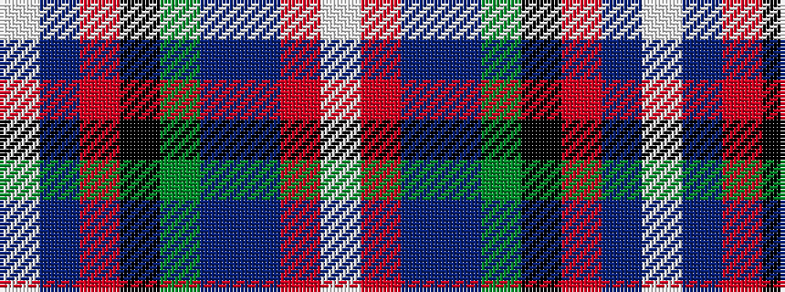

WBRKGBBRW

It is a 9 stripe tartan.

<figure class="pat-woven">

<figcaption>idealised sample</figcaption>
</figure>

## Colour Sequence



## Tartans with this colour sequence

| Tartans |
|---------------|
| [Scottish National - 1934 (Fashion)](/variants/s9/w2r3db6db8g12k1r4db2w2~x4/)|
||
