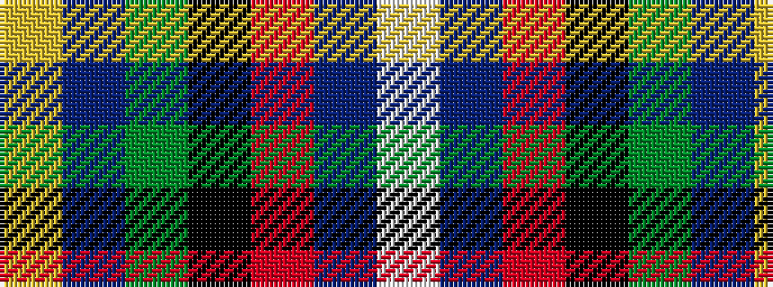

WBRKGBY

It is a 7 stripe tartan.

<figure class="pat-woven">

<figcaption>idealised sample</figcaption>
</figure>

## Colour Sequence



## Tartans with this colour sequence

| Tartans |
|---------------|
| [Buschke (Skye) (Personal)](/setts/s7/ly2do4dg11k30r2db16w1~x2/)|
||
| [Buschke (Skye) (Personal)](/setts/s7/ly2dr4dg11k30r2db16w1~x2/)|
||
