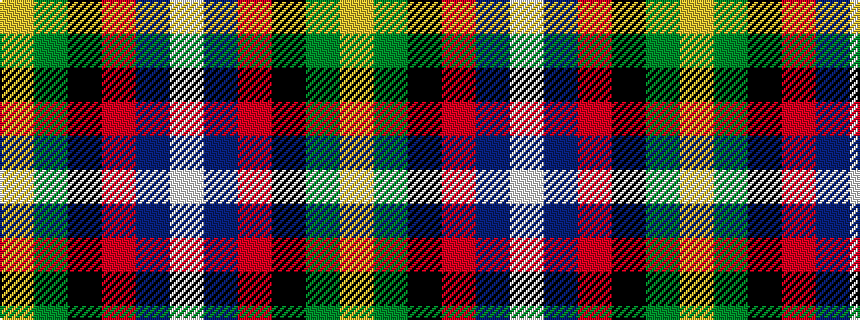

WBRKGY

It is a 6 stripe tartan.

<figure class="pat-woven">

<figcaption>idealised sample</figcaption>
</figure>

## Colour Sequence



## Tartans with this colour sequence

| Tartans |
|---------------|
| [Morris of Balgonie](/variants/s6/w3dp22r3k22g22ly2~x2/)|
||
| [Morris of Balgonie (Personal)](/variants/s6/w2dp20r3k10g20lo2~x2/)|
||
| [Morris of Eddergoll (Personal)](/variants/s6/w2db20r3k10g20lo2~x2/)|
||
