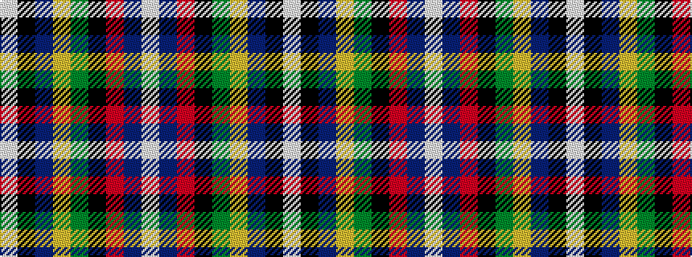

WBRKGYBKW

It is a 9 stripe tartan.

<figure class="pat-woven">

<figcaption>idealised sample</figcaption>
</figure>

## Colour Sequence



## Tartans with this colour sequence

| Tartans |
|---------------|
| [National](/variants/s9/w2db3r6k8g12ly1db4k2w2~x2/)|
||
| [National (1934), The](/variants/s9/w2db3r6k8g12lo1db4k2w2~x2/)|
||
| [National Millennium](/variants/s9/w2db4r16k12g36ly1db6k2w2~x2/)|
||
| [National Millennium](/variants/s9/w2db4r16k14dg32ly1db8k2w2~x2/)|
||
