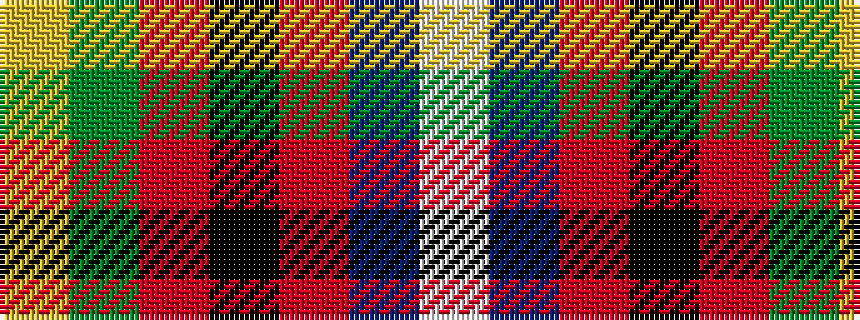

WBRKRGY

It is a 7 stripe tartan.

<figure class="pat-woven">

<figcaption>idealised sample</figcaption>
</figure>

## Colour Sequence



## Tartans with this colour sequence

| Tartans |
|---------------|
| [Souza Nery (Personal)](/variants/s7/ly4g22r3k17r3db37w3~x2/)|
||
