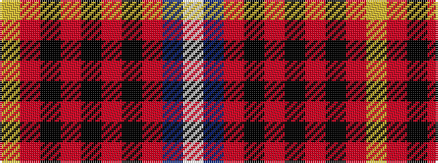

WBRKRKRKRY

It is a 10 stripe tartan.

<figure class="pat-woven">

<figcaption>idealised sample</figcaption>
</figure>

## Colour Sequence



## Tartans with this colour sequence

| Tartans |
|---------------|
| [Golfers](/variants/s10/lo4r2k9r25k3r2k3r4db15w3~x2/)|
||
| [Royal & Ancient/Golfing Stewart](/variants/s10/ly4r2k9r25k3r2k3r4db15w3~x2/)|
||
