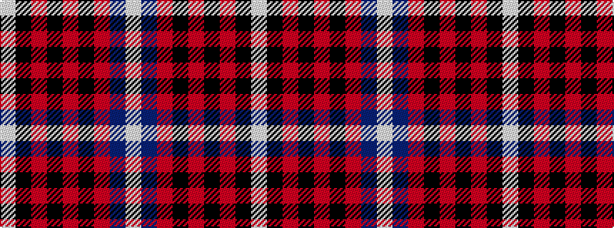

WBRKRKRKW

It is a 9 stripe tartan.

<figure class="pat-woven">

<figcaption>idealised sample</figcaption>
</figure>

## Colour Sequence



## Tartans with this colour sequence

| Tartans |
|---------------|
| [Memery (Reston, USA)](/variants/s9/w4k6r3k15r3k6r27db9w2~x2/)|
||
