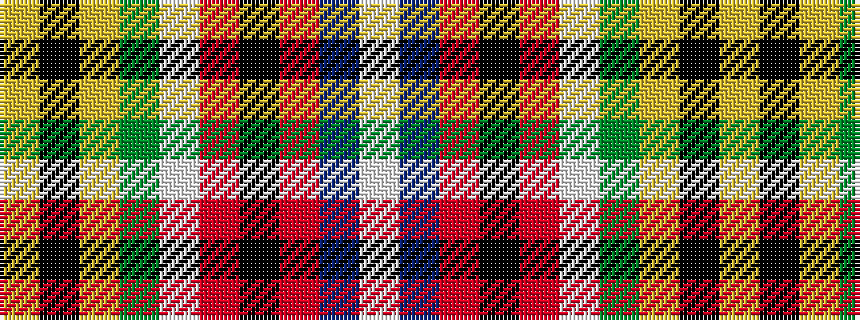

WBRKRWGYKY

It is a 10 stripe tartan.

<figure class="pat-woven">

<figcaption>idealised sample</figcaption>
</figure>

## Colour Sequence



## Tartans with this colour sequence

| Tartans |
|---------------|
| [City of Williams Lake (District)](/variants/s10/ly6k1ly3g3w3r3k2r3db3w3~x2/)|
||
