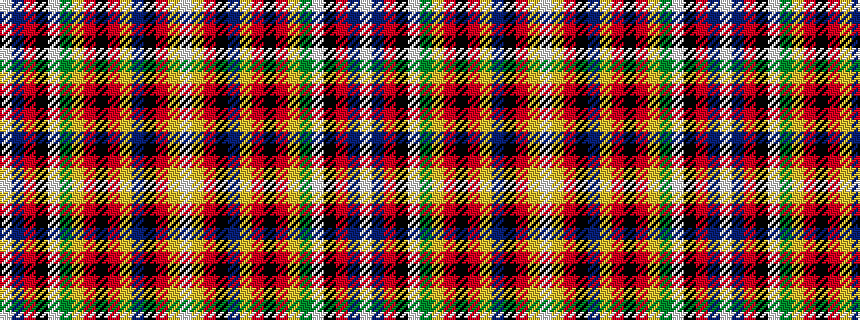

WBRKWGYRKRYBKRYW

It is a 16 stripe tartan.

<figure class="pat-woven">

<figcaption>idealised sample</figcaption>
</figure>

## Colour Sequence



## Tartans with this colour sequence

| Tartans |
|---------------|
| [Finzean's Fancy](/variants/s16/lb8lo8r6k6t28lo12r6k2r6lo12g28lb2k4r54dr1lb2~x2/)|
||
