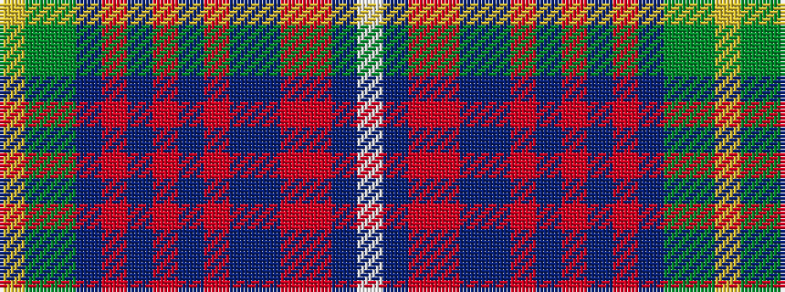

WBRRBBRBRBRBGGY

It is a 15 stripe tartan.

<figure class="pat-woven">

<figcaption>idealised sample</figcaption>
</figure>

## Colour Sequence



## Tartans with this colour sequence

| Tartans |
|---------------|
| [British Airways (Corporate)](/setts/s15/ly2y2dg20t2r2t2r10t2r2t2db20ri2r1db2w1~x2/)|
||
