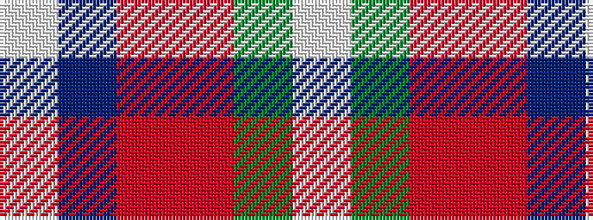

WBRRGW

It is a 6 stripe tartan.

<figure class="pat-woven">

<figcaption>idealised sample</figcaption>
</figure>

## Colour Sequence



## Tartans with this colour sequence

| Tartans |
|---------------|
| [Peterson, Oren (Name)](/setts/s6/w1db15r1o10g2lp1~x4/)|
||
