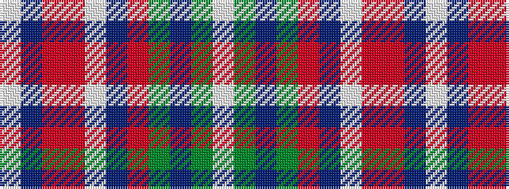

WBRRWBRGBGW

It is a 11 stripe tartan.

<figure class="pat-woven">

<figcaption>idealised sample</figcaption>
</figure>

## Colour Sequence



## Tartans with this colour sequence

| Tartans |
|---------------|
| [Glen Ross (WCWM - 1)](/variants/s11/lb21n4r1o1lb1n1o4y3n1y1lb1~x4/)|
||
