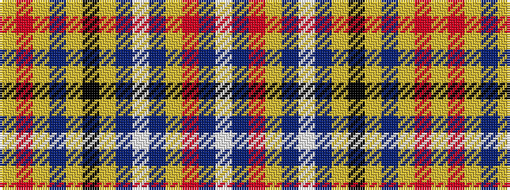

WBRYBWBYKYBYRY

It is a 14 stripe tartan.

<figure class="pat-woven">

<figcaption>idealised sample</figcaption>
</figure>

## Colour Sequence



## Tartans with this colour sequence

| Tartans |
|---------------|
| [Dalrymple of Castleton](/variants/s14/lo2r15lo3dr2lo3k14lo2t6w2t6lo2r7t10w1~x2/)|
||
