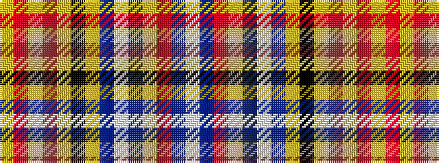

WBRYBWBYKYRYRY

It is a 14 stripe tartan.

<figure class="pat-woven">

<figcaption>idealised sample</figcaption>
</figure>

## Colour Sequence



## Tartans with this colour sequence

| Tartans |
|---------------|
| [Dalrymple of Castleton Portrait Tartan](/variants/s14/ly2r15ly3m2ly3k14ly2db6w2db6ly2r7db10w1~x2/)|
||
| [Dalrymple, of Castleton](/variants/s14/ly2r15ly3ri2ly3k14ly2db6w2db6ly2r7db10w1~x2/)|
||
