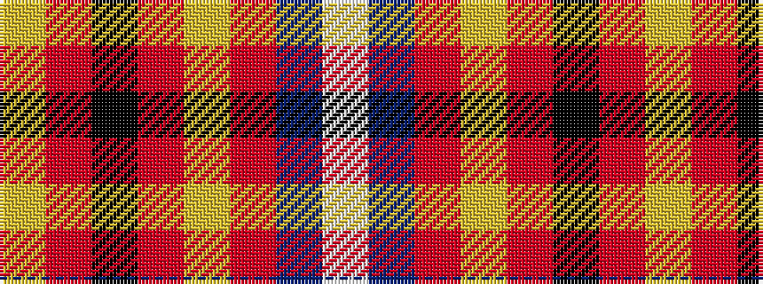

WBRYRKRY

It is a 8 stripe tartan.

<figure class="pat-woven">

<figcaption>idealised sample</figcaption>
</figure>

## Colour Sequence



## Tartans with this colour sequence

| Tartans |
|---------------|
| [Dalmagarry (Corporate)](/setts/s8/ly3r4k1r27ly14r4db15w2~x2/)|
||
