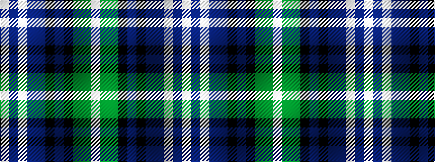

WBWBBKBKGGW

It is a 11 stripe tartan.

<figure class="pat-woven">

<figcaption>idealised sample</figcaption>
</figure>

## Colour Sequence



## Tartans with this colour sequence

| Tartans |
|---------------|
| [Carnegie of Skibo Corporate Tartan](/variants/s11/w3db5lt2db9dp10k2dp5k5dg9g31w2~x2/)|
||
