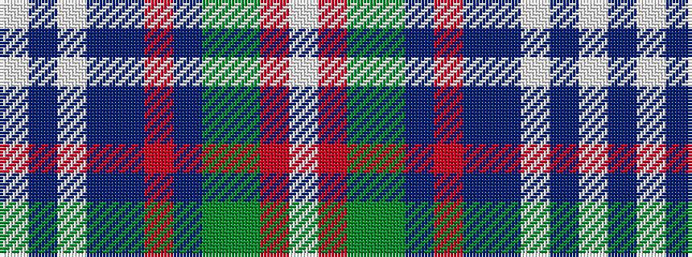

WBWBBRBGGRW

It is a 11 stripe tartan.

<figure class="pat-woven">

<figcaption>idealised sample</figcaption>
</figure>

## Colour Sequence



## Tartans with this colour sequence

| Tartans |
|---------------|
| [Fothergill (Personal)](/variants/s11/w50dbi3w8dbi8db12r4db12g16dg12o4w4/)|
||
