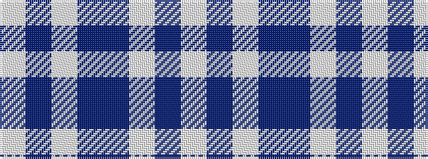

WBWBBWBW

It is a 8 stripe tartan.

<figure class="pat-woven">

<figcaption>idealised sample</figcaption>
</figure>

## Colour Sequence



## Tartans with this colour sequence

| Tartans |
|---------------|
| [Dunlop Dress](/setts/s8/w3db1w30db1dp28w1dp1w3~x2/)|
||
| [Dunlop, dress](/setts/s8/w3db1w30db1p28w1p1w3~x2/)|
||
