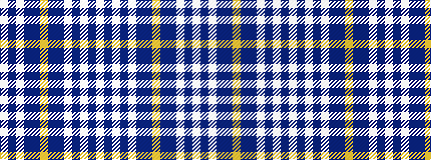

WBWBBYBBWBWBW

It is a 13 stripe tartan.

<figure class="pat-woven">

<figcaption>idealised sample</figcaption>
</figure>

## Colour Sequence



## Tartans with this colour sequence

This pattern is a design lineage: every tartan below shares one colour order, whatever its owner —
near-identical designs are grouped, the largest lineage first (#112: the pattern is a tartan's
second parent, beside its family or clan).

<table class="sett-table">
<tbody>
<tr><td><a href="/variants/s13/w69dp14w13dp14w13dp69db72ly13db72dp69w68dp14w13/">Poulter Tron</a></td></tr>
<tr><td class="sett-swatch"></td></tr>
<tr><td><a href="/variants/s13/w35dp7w7dp7w7dp35db36ly7db36dp35w35dp7w7/">Poulter Tron</a></td></tr>
<tr><td class="sett-swatch"></td></tr>
<tr class="cluster-sep"><td></td></tr>
<tr><td><a href="/variants/s13/lb16db2lb2db2lb2db16dbi16ly3dbi16db16lb16db2lb2~x2~db1204274-dbi1406275/">Adair (Name)</a></td></tr>
<tr><td class="sett-swatch"></td></tr>
</tbody>
</table>

