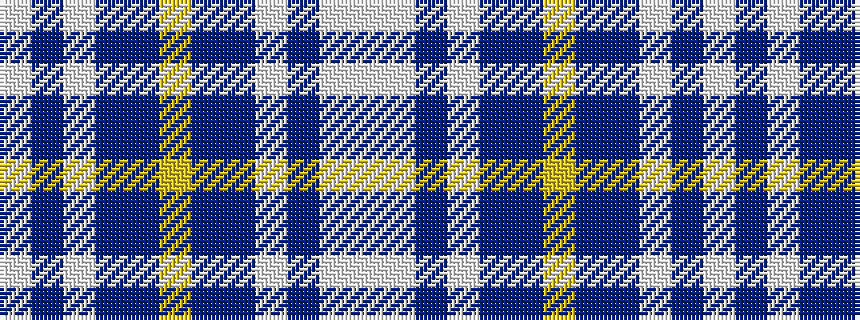

WBWBBYBBWBWW

It is a 12 stripe tartan.

<figure class="pat-woven">

<figcaption>idealised sample</figcaption>
</figure>

## Colour Sequence



## Tartans with this colour sequence

| Tartans |
|---------------|
| [Seaside](/setts/s12/w3lb2p4lb14n2t14lo2~x4/)|
||
